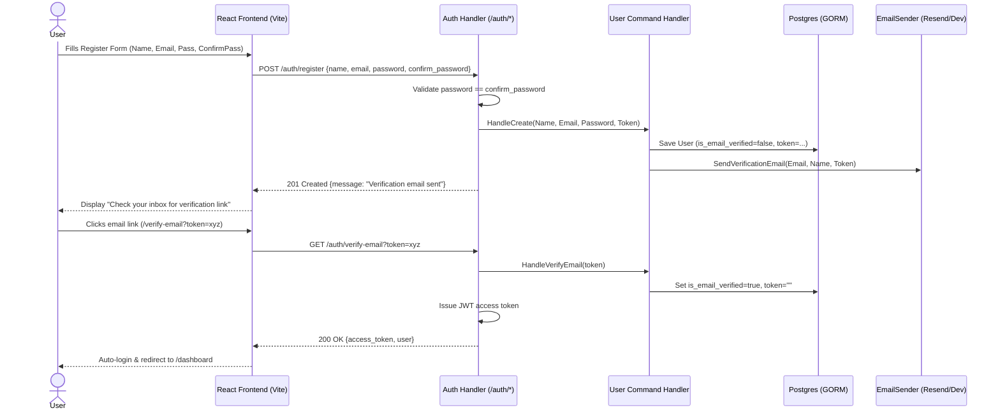
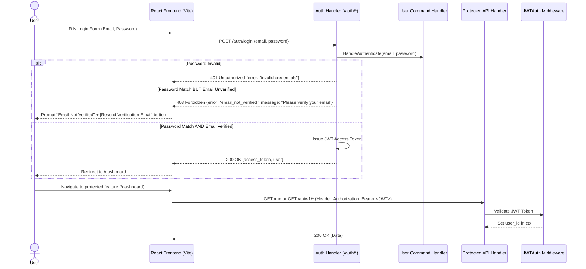

# Engineering Doc: Simplified Email Verification Auth

- Status: Done
- Slug: `simplified-email-verification-auth`
- Linked overview: `./01-overview.md`
- Skills consulted: `backend-go`, `crank-project`
- Author: Gemini 3.6 Flash / 2026-07-30
- Date: 2026-07-30

## 1. Summary

We are replacing/simplifying the authentication flow to support full email verification upon registration and mandatory verification checks upon login. Users sign up with Name, Email, Password, and Password Match (Confirm Password). Upon signup, an email verification token is stored and dispatched via an email sender (Resend / dev logger). Users cannot access the application UI until their email is verified. Upon login, if the email is not verified, access is denied with a prompt offering email verification resend. Once verified, a JWT token is issued and grants access to protected APIs.

## 2. High-Level Design

### Sequence Diagram: Registration & Verification Flow



### Sequence Diagram: Login & JWT Protection Flow



## 3. Low-Level Design

### Domain Layer (`internal/domain/user/`)
- `User` struct fields:
  - `IsEmailVerified bool` (`gorm:"column:is_email_verified;not null;default:false"`)
  - `VerificationToken string` (`gorm:"column:verification_token;type:TEXT"`)
- `NewUser`: Initializes `IsEmailVerified: false`, `VerificationToken: token`.
- `VerifyEmailToken`: Validates and clears verification token, sets `IsEmailVerified: true`.

### Application Layer (`internal/application/user/`)
- `CreateUserCommand`: Includes `Name`, `Email`, `Password`. Generates random secure token, saves aggregate, calls `EmailSender.SendVerificationEmail`.
- `AuthenticateUserCommand`: Returns `ErrEmailNotVerified` if `IsEmailVerified == false`.
- `VerifyEmailCommand`: Accepts token string, finds user by `verification_token`, calls domain `VerifyEmailToken`, saves aggregate.
- `ResendVerificationCommand`: Accepts email string, generates new token if unverified, sends verification email.

### Ports & Adapters (`internal/ports`, `internal/adapters/`)
- `EmailSender` interface in `internal/adapters/email/ports.go`:
  ```go
  type EmailSender interface {
      SendMagicLink(ctx context.Context, email, token string) error
      SendVerificationEmail(ctx context.Context, email, name, token string) error
  }
  ```
- Resend adapter in `internal/adapters/email/resend/client.go`: Implement `SendVerificationEmail`. In dev environment (if no API key), log `http://localhost:5173/verify-email?token=...`.

### HTTP Layer (`internal/adapters/http/web/auth_handler.go`)
- `POST /auth/register`: Payloads `{name, email, password, confirm_password}`. Validates password equality.
- `POST /auth/login`: Checks `ErrEmailNotVerified` -> returns `403 Forbidden` with body `{"error": "email_not_verified", "message": "Email address is not verified. Please check your email inbox or request a new verification link."}`.
- `GET /auth/verify-email`: Accepts `?token=...`. Verifies user, issues JWT access/refresh token pair.
- `POST /auth/resend-verification`: Payloads `{"email": "..."}`. Resends verification email.
- Middleware: `middleware.JWTAuth(h.tokens)` protects `/me` and `/api/*`.

### Frontend React SPA (`views/src/`)
- `views/src/api.ts`: Add `verifyEmailToken(token)` and `resendVerification(email)` client functions.
- `views/src/contexts/auth.tsx`:
  - Update `register`: pass `name, email, password, confirmPassword`.
  - Update `login`: handle `email_not_verified` error code.
  - Expose `verifyEmail(token)` and `resendVerification(email)`.
- `views/src/pages/Register.tsx`:
  - Form inputs: Name, Email, Password, Confirm Password.
  - Validation: Ensure passwords match before submitting.
  - On submit: Show success card prompting user to check inbox.
- `views/src/pages/Login.tsx`:
  - Show error alert if email is unverified with a "Resend Verification Email" button.
- `views/src/pages/VerifyEmail.tsx`:
  - Reads `token` query param.
  - Calls `verifyEmail(token)`. Shows state (Verifying -> Success / Invalid Token).
  - Automatically logs user in and redirects to `/dashboard`.
- Routing in `views/src/App.tsx`: Add `/verify-email` route.

## 4. Cross-Cutting Concerns

- **Validation**: Client-side & backend validation for password match, email format, minimum password length (8 chars).
- **Security**: Verification tokens are generated using cryptographically secure random bytes (hex/UUID). Passwords hashed with bcrypt/argon2 via `ports.Hasher`. JWT access tokens signed and verified via `ports.TokenService`.
- **Dev Experience**: If Resend API key is unset, log the full verification URL in stdout for fast local testing.

## 5. Testing Strategy

- `crank test` to verify backend domain, handlers, and HTTP routes.
- Manual frontend verification of signup, email verification link, login with unverified vs verified state, and JWT API calls.

## 6. Execution Strategy

- **Pattern**: Serial execution.
- Single developer agent updating domain models, application handlers, HTTP endpoints, email client, and React SPA views.

### Task Breakdown

| # | Task | Write Scope |
|---|------|-------------|
| 1 | Update User Domain & Schema | `internal/domain/user/`, `internal/adapters/persistence/` |
| 2 | Update Email Port & Resend Adapter | `internal/adapters/email/` |
| 3 | Update Application Commands & Handlers | `internal/application/user/` |
| 4 | Update HTTP Auth Handler & Routes | `internal/adapters/http/web/auth_handler.go` |
| 5 | Update Frontend API & Auth Context | `views/src/api.ts`, `views/src/contexts/auth.tsx` |
| 6 | Create/Update Frontend Pages | `views/src/pages/Register.tsx`, `Login.tsx`, `VerifyEmail.tsx`, `App.tsx` |
| 7 | Verification & Testing | Run tests & verify server compile |

## 7. Review

- Reviewer comments: Pending user review.
- Resolution / changes made: Initial draft.
- Approval: [ ] Approved by user
