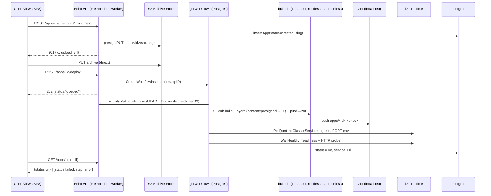

# Engineering Doc: Code Deploy Pipeline (Upload → Build → Run → URL)

- Status: Approved (rev 5)
- Slug: `code-deploy-pipeline`
- Linked overview: `./01-overview.md`
- Skills consulted (and what you took from each):
  - `backend-go` — layering law (domain ← application ← adapters), ports-first
    design, sentinel errors, UoW writes, Echo v5 handler conventions, config via
    Viper + env secrets, gomock test patterns.
  - `crank-project` — `crank make migration`, `crank test` / `crank swag` /
    `crank gofmt` as the validation loop.
- Author (agent/model + date): kimi-k3 / 2026-07-31
- Date: 2026-07-31

## 1. Summary

Evolve the existing v0 deploy path (`application/deploy/pipeline.go` —
synchronous, host-side nerdctl/docker build, fire-and-forget goroutine) into a
durable pipeline: the browser uploads the archive **directly to S3 via a
presigned URL**, builds run as **daemonless rootless buildah** processes on a
dedicated infra host (outside the workload cluster) pushing to **zot** on the
same infra host, and orchestration is a **go-workflows** durable workflow
(Postgres backend, worker embedded in the server binary). The k3s cluster runs only user
workloads (kata default, firecracker selectable) and pulls images from zot
over TLS with an `imagePullSecret`. Failures propagate as `failed_step` +
sanitized `error_message` — no log streaming in v1.

Rejected alternatives (from user review): host-side nerdctl/docker (arbitrary
`RUN` = code execution on the API host; no scale-out), Kaniko (daemonless
but weaker caching/tooling than buildah-on-host), BuildKit (persistent
buildkitd daemon = mTLS/firewall surface; remote-cache advantage moot on a
single-host builder), Temporal server (ops weight; swap path preserved via
`ports.Orchestrator`).

## 2. High-Level Design

- Components & boundaries:
  - **Echo API** (`adapters/http/web/v1`) — auth'd create/deploy/status/retry/delete.
    v1 deployment shape: the agni server binary (API + embedded worker) runs
    **on the infra host** alongside zot + buildah, so the builder adapter can
    shell out to local `buildah` (no daemon, agent, or SSH hop). k3s is
    reached via kubeconfig. If the API later moves off-host, a builder worker
    on the infra host takes over (follow-up).
  - **Application layer** — `application/app` command/query handlers (status
    transitions) + `application/deploy` orchestration façade.
  - **Ports** (new) — `ArchiveStore` (S3, presign), `ImageBuilder` (buildah
    subprocess), `Orchestrator` (go-workflows client). Existing
    `ContainerProvider` (k3s Pod/Service/Ingress) is extended with health.
  - **Workflow worker** — embedded in `cmd/server` (config flag allows a split
    `cmd/worker` later); hosts `DeploymentWorkflow` + activities.
  - **Infra (dedicated host, outside k3s)** — zot registry (`registry.<domain>`,
    TLS) with **S3 storage driver** (stateless; blobs/manifests in the
    `agni-registry` bucket) + rootless buildah (no daemon; one subprocess per
    build). Provisioning lives in `deploy/infra/` (systemd units or packages +
    config). k3s itself runs only user workloads + ingress.
- Data flow: create app → presigned PUT → browser uploads to S3 →
  `POST /apps/:id/deploy` → workflow instance (ID = app ID) → validate →
  BuildKit build (context = presigned GET) → push to zot → resolve port →
  deploy pod (RuntimeClass) → health check → URL persisted → `live`.
  Any failure → compensate (delete partial k8s resources) → `failed(step, reason)`.
  k3s pulls the image from zot via a per-namespace `imagePullSecret`.

## 3. Low-Level Design

- **Domain / business logic:** (`internal/domain/app`)
  - Extend `App`: add `Slug string`, `Port int32`, `ArchiveKey string`,
    `FailedStep string` (gorm columns). `Runtime` already exists (`kata` default).
  - Statuses: insert `StatusQueued` after `created`. Transitions:
    `created → queued → building → deploying → live`, any → `failed`,
    `failed → queued` (retry), any → `destroyed`. `created` only advances via
    `QueueDeploy` (i.e. upload done + deploy requested).
  - Invariants: `MarkLive` requires non-empty `ServiceURL`; `MarkFailed`
    requires `FailedStep` + reason.
  - New sentinels: `ErrNoDockerfile`, `ErrNoWebPort`, `ErrArchiveMissing`
    (user-facing, non-retryable).
- **Use case / application layer:** (`internal/application/app`, `internal/application/deploy`)
  - New commands: `QueueDeployCommand{ID}`, `RetryDeployCommand{ID}`
    (validates `failed → queued`).
  - `deploy.Service` (replaces `deploy.Pipeline`): `CreateUpload` (insert row,
    mint slug `<name>-<shortid>`, presign PUT, enforce `max_running_per_user`),
    `StartDeploy` (HEAD archive, transition to `queued`, start workflow),
    `Retry`, `Destroy`. Slug uniqueness: partial unique index + one regen retry.
- **Shared interfaces / contracts (ports):** — define FIRST
  - `ports.ArchiveStore`: `PresignedPutURL(ctx, key string, ttl time.Duration) (string, error)`,
    `PresignedGetURL(ctx, key string, ttl) (string, error)`,
    `Head(ctx, key) (size int64, ok bool, err error)`, `Delete(ctx, key) error`.
  - `ports.ImageBuilder`: `Build(ctx, BuildSpec) error` where
    `BuildSpec{AppID, ContextURL, Dockerfile, ImageRef, RegistryAuth, Timeout}`;
    v1 adapter shells out to local `buildah` on the infra host (per-build temp
    dir fetched from the presigned `ContextURL`). Returns wrapped
    `ErrBuildFailed` (user error, carries trimmed log tail) vs transient errors.
  - `ports.Orchestrator`: `StartDeployment(ctx, DeploymentInput) error`
    (idempotent on app ID; already-running → `ErrDeployInProgress` → HTTP 409),
    `CancelDeployment(ctx, appID string) error`.
  - Extend `ports.ContainerProvider` with
    `WaitHealthy(ctx, name string, port int32, timeout time.Duration) error`.
  - `//go:generate mockgen` on all new ports.
- **Data persistence:**
  - Migration **`20260731120000_add_deploy_pipeline_fields.up.sql`**:
    `ALTER TABLE apps ADD COLUMN slug TEXT, ADD COLUMN port INT NOT NULL
    DEFAULT 8080, ADD COLUMN archive_key TEXT NOT NULL DEFAULT '', ADD COLUMN
    failed_step TEXT NOT NULL DEFAULT ''; CREATE UNIQUE INDEX apps_slug_key ON
    apps(slug) WHERE slug <> '';` Down drops index + columns.
  - go-workflows Postgres backend tables: created by the backend's own
    `NewPostgresBackend` migration into schema `workflows` (separate from our
    migrations; documented, not hand-edited).
- **Transport / API layer:** (`internal/adapters/http/web/v1`, registered in `v1/routes.go`)
  - `POST /api/v1/apps` — JSON `{name, port?, runtime?}` → 201
    `{id, upload_url, upload_expires_at}`.
  - `POST /api/v1/apps/:id/deploy` — verifies archive object exists → 202
    `{status:"queued"}`; 409 if already queued/running; 422 if archive missing.
  - `GET /api/v1/apps/:id` — `{status, service_url, slug, failed_step, error_message}`.
  - `POST /api/v1/apps/:id/retry` — from `failed` only → new workflow execution.
  - `DELETE /api/v1/apps/:id` — cancel workflow + `Destroy` k8s resources + S3
    cleanup → `destroyed`.
  - All routes behind existing JWT middleware; ownership via
    `ports.ScopeChecker` → 404 on foreign ID (existing convention).
- **Background work:** (go-workflows, embedded in `cmd/server`)
  - Backend: `postgres.NewPostgresBackend(dsn, ...)` with schema `workflows`;
    worker started alongside the HTTP server when `deploy.worker_embedded: true`.
  - `DeploymentWorkflow(ctx, Input{AppID, ArchiveKey, Slug, PortOverride,
    Runtime})` — activities with `workflow.ActivityOptions{RetryOptions}`:
    1. `ValidateArchive` — S3 HEAD + fetch first bytes; confirm Dockerfile at
       archive root; enforce `max_archive_size_mb` → non-retryable
       `ErrNoDockerfile` / `ErrArchiveMissing`.
    2. `BuildImage` — subprocess: download archive via presigned GET to a
       per-build temp dir (size-capped), then `buildah build --layers -t
       <zot>/apps/<id>:<exec>` and `buildah push --creds ...`; runs as an
       unprivileged user (subuid/user namespaces) with `build_timeout_s`
       enforced via context kill; retries: 3× infra-only; user build failure
       → wrapped `ErrBuildFailed` with last ~20 lines, sanitized.
    3. `ResolvePort` — user override → image config `ExposedPorts` from zot
       (go-containerregistry) → 8080.
    4. `DeployRuntime` — provider.Deploy with `RuntimeClassName` + `PORT` env +
       resource limits (1 CPU / 512Mi defaults, configurable).
    5. `WaitHealthy` — pod Ready + HTTP GET (any status < 500) until
       `deploy_timeout_s`; exhausted → non-retryable `ErrNoWebPort`.
    6. `Finalize` — persist `https://<slug>.<share.domain>`, `MarkLive`.
    - Compensation on failure: `CleanupPartial` (delete Pod/Svc/Ingress, keep
      S3 archive for retry) then `MarkFailed(step, reason)`. Workflow-level
      timeout `workflow_timeout_s`. Cancellation honored on delete.
- **Generated / mocked code:**
  - `go generate ./...` (gomock for new ports), `crank swag` after handlers.
- **Configuration:** (`configs/config.yaml`, secrets via env)
  - `workflows:` `schema: "workflows"` (reuses `database.dsn`)
  - `s3:` `endpoint` (empty = AWS), `region`, `bucket`,
    `access_key`/`secret_key` via `env:"AGNI_S3_*"`, `upload_presign_ttl: 15m`,
    `build_presign_ttl: 30m`
  - `registry:` `url` (external zot, e.g. `registry.<domain>`),
    `username`/`password` via env, `storage_bucket: "agni-registry"` (S3
    backend; zot gets its own scoped S3 credentials via env); k3s-side
    credentials replicated into an `imagePullSecret` per app namespace
  - `buildah:` `binary: "buildah"`, `run_user: "agni-builder"`,
    `storage_root: "/var/lib/agni-builds"`, `timeout_s: 900`
  - extend `deploy:` `worker_embedded: true`, `engine: workflow|local`,
    `max_archive_size_mb`, `build_timeout_s`, `deploy_timeout_s`,
    `workflow_timeout_s: 1800`, `health_interval_s: 5`,
    `max_running_per_user: 1`
  - extend `k3s:` `firecracker_runtime_class: "firecracker"`,
    `registry_pull_secret: "zot-pull"`
- **Error handling & edge cases:**
  - User errors (missing Dockerfile, build failed, no web port, archive
    missing) → typed, non-retryable; API surfaces `failed_step` + sanitized
    message (strip file paths, registry internals, presigned query params).
  - Zip-slip: keep existing extraction guard for validation; BuildKit consumes
    the raw archive (never extracted server-side) — validation extraction is
    size-capped and path-sanitized.
  - Upload without deploy: rows stuck in `created` — acceptable; a janitor can
    GC them later (follow-up).
  - Duplicate deploy click → `ErrDeployInProgress` → 409.
  - Slug unique violation → regenerate suffix once, then 500.
  - Presigned URL expiry → client re-GETs `POST /apps/:id/upload-url`
    (small extra endpoint, same handler package).

## 4. Cross-Cutting Concerns

- Validation: DTO `validate:` tags; `runtime` enum (`kata`|`firecracker`);
  `port` 1–65535; archive magic-byte sniff at `ValidateArchive` (zip/gzip).
- Auth / permissions: JWT on all endpoints; ScopeChecker owner check;
  `max_running_per_user` enforced at `CreateUpload`.
- Observability: slog with `app_id`, `instance_id`, `step` attrs; workflow
  history in Postgres is the audit trail; go-workflows diag UI optional later.
- Caching: none new.
- Transactions / consistency / idempotency: status transitions via existing
  UoW (`SaveAndPublish`); workflow instance ID = app ID (idempotent start);
  k8s creates are create-or-update (existing provider pattern); slug unique
  index as DB backstop.
- Security & performance: presigned URLs short-lived, single-key, no listing;
  builds are ephemeral rootless subprocesses (user namespaces + subuid) — no
  daemon socket exists to attack; zot writable only by the builder host,
  readable by k3s nodes; registry creds only in env / k8s pull secret;
  kata/firecracker isolation at runtime; archive never buffered in API memory
  (direct-to-S3).

## 5. Testing Strategy

- Unit tests (mocked): status transition table tests (domain); command
  handlers with gomock; activities with mocked ports; workflow via
  go-workflows `tester` package (happy path, build-fail compensation,
  no-web-port, cancel-on-delete).
- Integration tests: k3s provider with fake clientset (existing
  `provider_test.go` pattern); S3 adapter against MinIO container (build-tag
  gated); go-workflows Postgres backend spun against test Postgres.
- End-to-end: manual script on dev k3s — fixture Dockerfile app through full
  flow asserting URL 200; missing-Dockerfile fixture asserting `failed` with
  `failed_step=validate`.
- NOT tested in v1: real BuildKit build in CI (covered by e2e script), zot auth
  failure modes, firecracker runtime (fixture runs on kata).

## 6. Rollout

- Order: (1) migration `20260731120000` + workflows schema; (2) provision the
  infra host (`deploy/infra/`: zot with S3 storage driver, buildah +
  subuid/subgid setup, TLS, firewall), create the `agni-registry` bucket and
  scoped credentials, create the k3s `imagePullSecret`, verify push from
  builder and pull from a k3s node; (3) ship API + embedded worker; (4) e2e
  fixture; (5) views UI (two-step upload with progress).
- Backward compatibility: existing `apps` rows get `slug=''` (index ignores
  empty), `port=8080`; API gains endpoints/fields, removes none.
- Feature flags: `deploy.engine: workflow|local` (default `workflow`) keeps the
  legacy pipeline selectable on machines without a cluster.
- Follow-up work: log streaming, multi-port, build cache tuning
  (zot-backed cache / `--cache-from` evaluation), Docker Hub pull-through
  cache in zot, per-user quotas, janitor for stale `created` rows,
  firecracker soak test, diag UI, buildah-as-library (drop subprocess),
  builder worker on the infra host (when the API moves off it).

## 7. Execution Strategy

- **Pattern:** Interface-first — serial pre-phase defines ports, domain
  changes, and the migration number; parallel agents build adapters/handlers
  against them; serial post-phase wires `main.go`/`routes.go`/config and
  regenerates.

### Shared choke points for THIS feature

| File / dir | Category | Strategy |
|------------|----------|----------|
| `internal/ports/*.go` | shared interfaces | serial pre-phase only |
| `db/migrations/` | schema migrations | number reserved in pre-phase (`20260731120000`) |
| `cmd/server/main.go` | composition root (+ embedded worker) | serial post-phase wiring |
| `internal/adapters/http/web/v1/routes.go` | route registry | serial post-phase |
| `configs/config.yaml`, `internal/config/` | config | serial post-phase |
| `go.mod` / `go.sum` | package manifest | single `crank tidy` at end (adds go-workflows, minio-go, go-containerregistry) |

### Task breakdown

| # | Task | Owner | Write scope | Depends on | Serial/Parallel |
|---|------|-------|-------------|------------|-----------------|
| 1 | Define ports; domain fields/transitions; migration | agent-A | `internal/ports/`, `internal/domain/app/`, `db/migrations/20260731120000_*` | — | Serial pre |
| 2 | S3 `ArchiveStore` adapter (presign put/get/head/delete) | agent-B | `internal/adapters/storage/s3/` | 1 | Parallel |
| 3 | Buildah `ImageBuilder` adapter (subprocess runner) | agent-C | `internal/adapters/builder/buildah/` | 1 | Parallel |
| 4 | k3s provider: `WaitHealthy`, firecracker class, PORT env | agent-C | `internal/adapters/provider/k3s/` | 1 | Parallel |
| 5 | go-workflows workflow + activities + `Orchestrator` adapter | agent-D | `internal/adapters/workflow/`, `internal/application/deploy/` | 1 | Parallel |
| 6 | HTTP handlers (create/deploy/upload-url/status/retry/delete) + DTOs | agent-E | `internal/adapters/http/web/v1/app_handler.go` + dto files | 1 | Parallel |
| 7 | Wire main.go (incl. embedded worker), routes.go, config blocks; `go generate`, `crank swag`, `crank tidy` | agent-A | choke-point files | 2–6 | Serial post |
| 8 | Infra host provisioning (zot w/ S3 storage driver, buildah, subuid/subgid, TLS, firewall), `agni-registry` bucket + scoped creds, k3s pull secret + runtime classes; e2e fixture script | agent-C | `deploy/` | 7 | Serial post |

- Hand-off notes: 3 and 4 share agent-C (adjacent k8s concerns) to avoid
  clientset helper conflicts; 5 consumes ports only, never concrete adapters.
- Shared interfaces defined first (pre-phase): `ArchiveStore`, `ImageBuilder`,
  `Orchestrator`, extended `ContainerProvider`, new app commands, migration
  `20260731120000`.

## 8. Review

- Reviewer comments: (2026-07-31) Four revision rounds — BuildKit, then
  external infra host, then Buildah, then S3-backed zot — all incorporated
  (revs 2–5).
- Resolution / changes made: see rev history in `01-overview.md` §7.
- Approval: [x] Approved by user (2026-07-31) — "okay now make a detailed
  document about the changes needed in the codebase"
