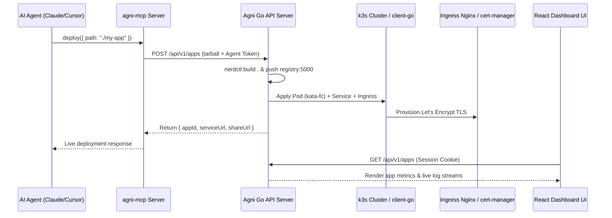

# Engineering Doc: Agni — MCP-First App Hosting Platform (v1)

- Status: Approved
- Slug: `edge-mcp-v1`
- Linked overview: `./01-overview.md`
- Skills consulted:
  - `crank-project`: Followed Crank CLI guidelines and embedded React Vite SPA conventions in `views/`.
  - `backend-go`: DDD + CQRS hexagonal patterns for Go aggregate boundaries, Echo handlers, and GORM persistence.
- Author: Gemini 3.6 Flash / 2026-07-29
- Date: 2026-07-29

## 1. Summary

Agni is an open, agent-native hosting platform leveraging k3s and Kata Containers (Firecracker microVMs). This document outlines the frontend SPA design in `views/`, backend Go architecture in `internal/`, k3s operator integration, and required API surface.

## 2. High-Level Design

## 3. Low-Level Design

### Frontend Architecture (`views/`)
- **Landing Page (`views/src/pages/LandingPage.tsx`):** Navbar with flame logo, Hero with obsidian gradient, interactive `TerminalDemo` agent simulator, `Architecture` microVM flow diagram, `Features` grid, and `Footer`.
- **Auth Page (`views/src/pages/Login.tsx`):** Magic link email dispatcher tab + Agent API key token generator tab (`claude_desktop_config.json`, `cursor.json`).
- **Dashboard (`views/src/pages/Dashboard.tsx`):** Health overview bar (Active MicroVM Pods, Memory, Requests/sec), status filter dropdown, app cards grid, streaming `LogViewer`, `ShareModal`, and `DeploySimulatorModal`.
- **App Detail (`views/src/pages/AppDetail.tsx`):** Single app metrics, Kata Pod metadata, embedded logs terminal, share management, environment variable editor, and destroy action.
- **Mock Data Layer (`views/src/api.ts`):** `localStorage`-backed API fallback for standalone frontend execution.

### Backend Architecture (`internal/`)
- **Domain Layer (`internal/domain/`):**
  - `app`: Aggregate root (`App`, `Status`: created|building|deploying|live|failed|destroyed).
  - `sharelink`: Aggregate root (`ShareLink`, `Permission`: use|admin).
- **Adapters (`internal/adapters/`):**
  - `provider/k3s`: Client-go integration for Pod/Service/Ingress management with `kata-fc` runtime class.
  - `persistence/gorm`: GORM SQLite repositories for `App` and `ShareLink`.
  - `auth/agentapikey`: JWT issuer/validator for MCP agents.
  - `email/resend`: Resend API integration for magic link emails.
- **HTTP Handlers (`internal/adapters/http/web/v1/`):**
  - `app_handler.go`: Tarball deploy, list apps, get app detail, destroy app, stream logs.
  - `share_handler.go`: Issue share link, list app share links, revoke share link.
  - `magic_handler.go`: Dispatch magic link email, verify magic link token.
  - `session_handler.go`: Nginx auth-url validation endpoint (`/auth/session?app={id}`).

## 4. Required API Surface

1. `POST /api/v1/apps` — Multipart tarball deploy (Agent Token).
2. `GET /api/v1/apps` — List user's apps (Session / Agent Token).
3. `GET /api/v1/apps/:id` — Get app metadata (Session / Agent Token).
4. `DELETE /api/v1/apps/:id` — Destroy app & k3s resources (Session / Agent Token).
5. `GET /api/v1/apps/:id/logs` — Streaming logs SSE/WebSocket (Session / Agent Token).
6. `POST /api/v1/apps/:id/share` — Create magic share link (Session / Agent Token).
7. `GET /api/v1/apps/:id/shares` — List app shares (Session / Agent Token).
8. `DELETE /api/v1/apps/:id/shares/:sid` — Revoke share link (Session / Agent Token).
9. `POST /auth/magic` — Request magic link email (Public).
10. `GET /auth/magic?token=...` — Verify magic link & set session cookie (Public).
11. `POST /auth/agent-token` — Generate agent JWT (Session Cookie).
12. `GET /auth/session?app={appId}` — Ingress auth-url session validator (Internal/Ingress).
13. `GET /api/v1/me` — Authenticated profile (Session / Agent Token).
14. `GET /api/v1/cluster/health` — Cluster telemetry (Session / Agent Token).

## 5. Testing & Verification

- **Frontend:** `npm run check` (`tsc --noEmit`) and `npm run build` (`vite build`).
- **Backend:** `crank test` unit and integration tests.

## 6. Execution Strategy

- **Pattern:** Parallel-then-wire (Subagents built Landing, Dashboard, and Auth/Mock-API layers in parallel, then reconciled routes in `App.tsx`).

## 7. Review

- Approval: [x] Approved by user (2026-07-29)
