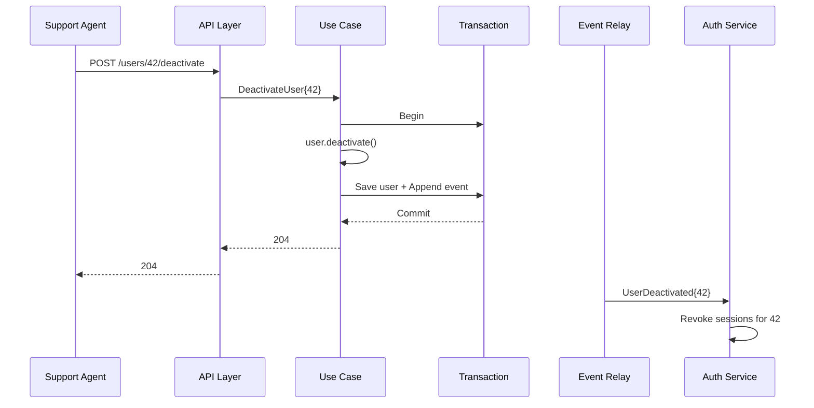

# Engineering Doc: User Deactivation

- Status: Done
- Slug: `user-deactivation`
- Linked overview: `./01-overview.md`
- Skills consulted (and what you took from each):
  - No project-specific agent skills available for this stack; leaned on the
    existing layered architecture and event-publisher pattern already in the
    codebase.
- Author (agent/model + date): example / 2026-07-18
- Date: 2026-07-18

## 1. Summary

Add a `status` field to the user entity with two state transitions
(`active → deactivated`, `deactivated → active`) exposed as two new endpoints.
Session revocation is asynchronous via the existing event publisher. Auth
middleware gains a cached status check.

## 2. High-Level Design

- Components & boundaries: domain invariant on `User`, two use cases, one schema
  column, two API routes, one new event, one cached check in auth middleware.
- Data flow: `POST /users/:id/deactivate` → use case → `User.deactivate()` →
  repository save (in a transaction) → event row appended → commit. A relay
  publishes the event; the auth service consumes it and revokes sessions.

## 3. Low-Level Design

- **Domain / business logic:**
  - Add `status` value (`active`, `deactivated`) and `deactivatedAt` timestamp
    on the user entity.
  - Methods: `User.deactivate()`, `User.reactivate()`. Invariants: cannot
    deactivate an already-deactivated user (return domain error; handler layer
    makes it idempotent by mapping to a 204); cannot reactivate a hard-deleted
    user (not reachable via this path).
- **Use case / application layer:**
  - `DeactivateUser{ID}` use case: load via repository, call domain method,
    save inside a transaction, append event.
  - `ReactivateUser{ID}` use case: mirror image.
- **Shared interfaces / contracts:**
  - No new ports. Reuses the existing user repository, transaction abstraction,
    and event publisher.
- **Data persistence:**
  - Add `status` and `deactivated_at` columns (or equivalent fields in the
    project's data store).
  - Migration `042_add_user_status`: add fields, default `'active'`, index on
    `status`. Number 042 reserved here.
- **Transport / API layer:**
  - `POST /users/:id/deactivate` → 204 on success, 404 if user missing,
    204 if already deactivated (idempotent).
  - `POST /users/:id/reactivate` → 204 / 404.
  - Register both routes in the project's route/endpoint registry (serial wiring).
- **Background work:** session revocation is handled by the auth service
  reacting to the published event; no new worker in this service.
- **Generated / mocked code:** if mocks/fakes are generated for tests, regenerate
  once at the end of the build via the project's usual command.
- **Configuration:** new key `auth.status_cache_ttl`, default `60s`.
- **Error handling & edge cases:**
  - Reactivation race (see overview Risks): the auth-service consumer ignores
    stale revocation messages when a newer `UserReactivated` event has been
    emitted. Tracked via `deactivatedAt` comparison on the consumer.

## 4. Cross-Cutting Concerns

- Validation: ID must be a valid identifier; handler returns 400 otherwise.
- Auth / permissions: only `support` and `admin` roles may call the new endpoints.
- Observability: span per use case; log every state transition with `user_id`
  and `actor_id`.
- Caching: auth middleware caches `user_id → status` with TTL from config.
- Transactions / consistency / idempotency: use case writes user update + event
  row in one transaction; deactivation is idempotent.
- Security & performance: cache prevents a DB hit on the auth hot path.

## 5. Testing Strategy

- Unit tests (mocked collaborators):
  - `User.deactivate` / `reactivate` invariant tests in the domain layer.
  - Use-case tests with mocked repository, transaction, and event publisher.
- Integration tests (real DB):
  - Repository round-trip for the status field.
  - End-to-end handler test against a migrated DB.
- What is explicitly NOT tested, and why: the auth-service session-revocation
  consumer (separate service, separate repo).

## 6. Rollout

- Migration steps: `042_add_user_status` is additive (default `'active'`), safe
  to apply online. Backfill not required.
- Backward compatibility: existing code reading users continues to work; the new
  `status` field is ignored by older code paths.
- Feature flags: gate the new endpoints behind a `user_deactivation` flag until
  consumers are ready.
- Follow-up work: cancel in-flight background jobs owned by deactivated users.

## 7. Execution Strategy

- **Pattern:** Interface-first, then Parallel-then-wire. Rationale: no new ports,
  but the migration number must be reserved up front so the persistence agent
  and the domain agent don't collide. Route registration, bootstrap, and code
  regeneration handled in a serial close-out.

### Shared choke points for THIS feature

| File / dir | Category | Strategy |
|------------|----------|----------|
| route/endpoint registry | Route registry | Serial post-wiring (Task 7) |
| app bootstrap / DI root | Bootstrap | Serial post-wiring (Task 7) |
| generated mocks/fakes | Generated code | Regenerate once at end (Task 7) |
| migration sequence | Migrations | Number reserved in serial pre-phase (Task 1) |
| package manifest + lockfile | Package manifest | Single tidy/install at end (Task 7) |

### Task breakdown

| # | Task | Owner (agent) | Write scope (files/dirs) | Depends on | Serial or Parallel |
|---|------|---------------|--------------------------|------------|--------------------|
| 1 | Reserve migration number + add event types | agent-A | migration `042_*`, event definitions | - | Serial pre |
| 2 | Domain `User` changes + unit tests | agent-B | domain layer (user) | 1 | Parallel |
| 3 | Persistence model + repo tests | agent-C | persistence layer (user) | 1 | Parallel |
| 4 | Use cases + tests | agent-D | use-case layer (user) | 2 | Parallel |
| 5 | API handlers (no route registration) | agent-E | API/transport layer (user) | 4 | Parallel |
| 6 | Auth middleware status check + cache | agent-F | auth middleware, config | 1 | Parallel |
| 7 | Wire routes + bootstrap + regenerate + tidy | agent-A | choke-point files | 2,3,4,5,6 | Serial post |

- Hand-off / ordering notes: Task 7 is the single serial close-out; no other
  agent touches the route registry, app bootstrap, generated code, or package
  manifest.
- Shared interfaces that must be defined first: none new; existing ports suffice.

## 8. Review

- Reviewer comments: "Confirm 042 isn't taken." "Add idempotency decision."
- Resolution / changes made: confirmed 042 free; idempotency defaulting to 204
  either way, flagged in §3.
- Approval: [x] Approved by user (2026-07-18)
