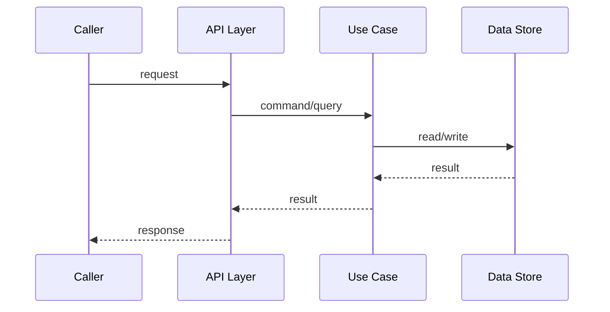

# Engineering Doc: <Feature Name>

- Status: Draft | In Review | Approved | Done
- Slug: `<feature-slug>`
- Linked overview: `./01-overview.md`
- Skills consulted (and what you took from each):
  - list any domain/language/framework skills loaded for this task, plus the
    takeaway from each. If none were available, say so and note which existing
    project patterns you leaned on instead.
- Author (agent/model + date): <...>
- Date: <YYYY-MM-DD>

## 1. Summary

One paragraph: what we are building and the chosen approach.

## 2. High-Level Design

- Components & boundaries:
- Data flow:
- Sequence / interaction diagram (mermaid encouraged here, optional in Phase 1):

## 3. Low-Level Design

Walk the project's actual layering (adapt the categories below to what the
project uses — discovered in Step 0). Skip rows that don't apply; add rows for
project-specific concerns (e.g. queues, cron jobs, webhooks, view templates,
mobile screens).

- **Domain / business logic:**
  - Entities / aggregates / value objects / domain services:
  - Invariants / business rules:
- **Use case / application layer:**
  - Commands / operations / service methods:
  - Queries / reads:
  - DTOs / view models:
- **Shared interfaces / contracts (ports, protocols, types):**
  - New / changed interfaces — define these FIRST if multiple agents will consume them:
- **Data persistence:**
  - Schema changes (tables/collections/indexes):
  - Repository / DAO / model layer changes:
  - Migration files (assign sequence numbers here, never in parallel):
- **Transport / API layer:**
  - Endpoints / routes / resolvers / handlers:
  - Where they get registered (name the registry file):
  - Request / response / event payload shapes:
- **Background work (if applicable):**
  - Queues, workers, scheduled jobs, async side-effects:
- **Generated / mocked code:**
  - What needs regeneration, and the command to do it:
- **Configuration:**
  - New config keys / env vars / feature flags:
- **Error handling & edge cases:**

## 4. Cross-Cutting Concerns

- Validation:
- Auth / permissions:
- Observability (tracing/logging/metrics):
- Caching:
- Transactions / consistency / idempotency:
- Security & performance:

## 5. Testing Strategy

- Unit tests (mocked collaborators) — where:
- Integration tests (real DB / real services) — where:
- End-to-end / contract tests (if applicable):
- What is explicitly NOT tested, and why:

## 6. Rollout

- Migration / deploy steps (and order if multiple):
- Backward compatibility:
- Feature flags:
- Follow-up work:

## 7. Execution Strategy

- **Pattern:** Serial | Parallel-then-wire | Interface-first — decision + rationale:
- If parallel: which serial pre-phase defines shared interfaces / migration numbers?
- If parallel: which serial wiring phase closes out registries, bootstrap, generated code, deps?

### Shared choke points for THIS feature

List the concrete files in this project that fall into choke-point categories
(registries, bootstrap/DI, shared interfaces, generated code, migrations,
package manifests, build config) and the strategy for each.

| File / dir | Category | Strategy |
|------------|----------|----------|
| ... | e.g. route registry | serial post-wiring |
| ... | e.g. package manifest | serial tidy at end |

### Task breakdown

Each parallel task MUST have a disjoint write scope. Choke-point files are NOT
disjoint — handle them in a serial phase.

| # | Task | Owner (agent) | Write scope (files/dirs) | Depends on | Serial or Parallel |
|---|------|---------------|--------------------------|------------|--------------------|
| 1 | Define interfaces + reserve migration numbers | agent-A | <shared contract files>, <migration N> | - | Serial pre |
| 2 | ... | ... | ... | 1 | Parallel |
| 3 | ... | ... | ... | 1 | Parallel |
| N | Wire registries + bootstrap + regenerate + tidy | agent-A | choke-point files | 2..N-1 | Serial post |

- Hand-off / ordering notes for dependent tasks:
- Shared interfaces that must be defined first (restate from the serial pre-phase):

## 8. Review

- Reviewer comments:
- Resolution / changes made:
- Approval: [ ] Approved by user (date)
